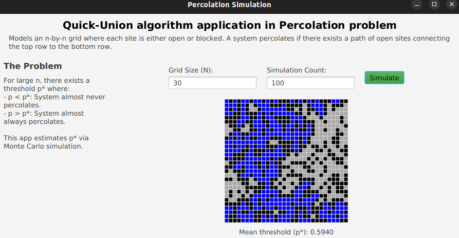

# 💧 Percolation Simulation with Quick-Union (Java + JavaFX)

This project simulates **percolation**, a fundamental model in statistical physics used to study phenomena like electrical conductivity and fluid flow through porous materials. The simulation estimates the **percolation threshold (p\*)** — the critical probability where a system transitions from non-percolating to percolating.

---

## 🧠 About the Problem

In percolation theory:

- We model a system as an `n x n` grid.
- Each **site** in the grid can be **blocked** or **open**.
- A **full site** is an open site connected to the top via a chain of neighboring open sites.
- A system **percolates** if water (or electricity) can flow from top to bottom via open sites.

This simulation answers the question:

> **"Given a random distribution of open sites, what fraction needs to be open for the system to percolate?"**

This critical fraction is known as the **percolation threshold** `p*`.

---

## 🎯 Features

✅ Java implementation of the **Quick Union** algorithm (Union-Find).  
✅ Monte Carlo simulation to estimate `p*`.  
✅ JavaFX UI for interactive visualization.  
✅ Grid coloring:
- 🔲 **Black**: Blocked site
- 🟦 **Blue**: Full (connected to top)
- ⬛ **Dark Gray**: Open but not full

---

## 🛠 Technologies Used

- Java (Core Logic)
- JavaFX (UI and Visualization)
- Object-Oriented Design
- Quick-Union Union-Find (naive version)

---

## 🎓 Author’s Note

> I developed this project while learning **Java**, **JavaFX**, and **algorithms** (especially union-find and simulation methods). It helped me understand:
>
> - How dynamic connectivity works in grid systems
> - How to structure simulations and estimate probabilities with Monte Carlo methods
> - How to build clean UI in JavaFX from scratch

---

## 🚀 Getting Started

### Prerequisites
- Java 11+
- JavaFX SDK

### Run the Project

Run from IntelliJ.

---

## 📈 How the Simulation Works

1. User inputs:
    - Grid size (n)
    - Number of simulations
2. Each simulation randomly opens sites until the system percolates.
3. For each run, the ratio of open sites is recorded.
4. The average ratio over all simulations is displayed as an estimate of `p*`.

  

---

## 📚 References

- [Princeton Algorithms Course (Percolation)](https://coursera.cs.princeton.edu/algs4/assignments/percolation/specification.php)
---

## 👤 Author

**Angel Chaico**  
💡 Interested in AI, backend development, and agricultural tech.

---

## 🧩 Future Improvements

- Implement **Weighted Quick Union with Path Compression** for faster performance.

